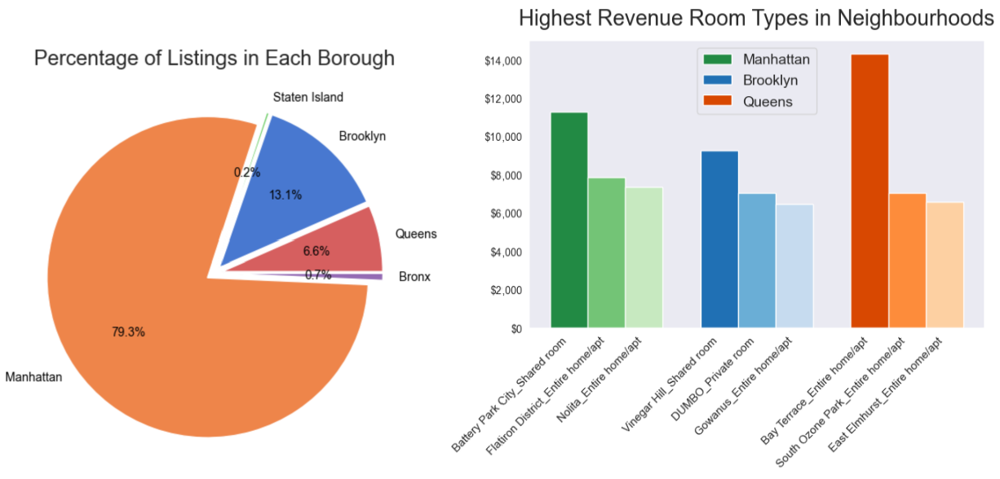
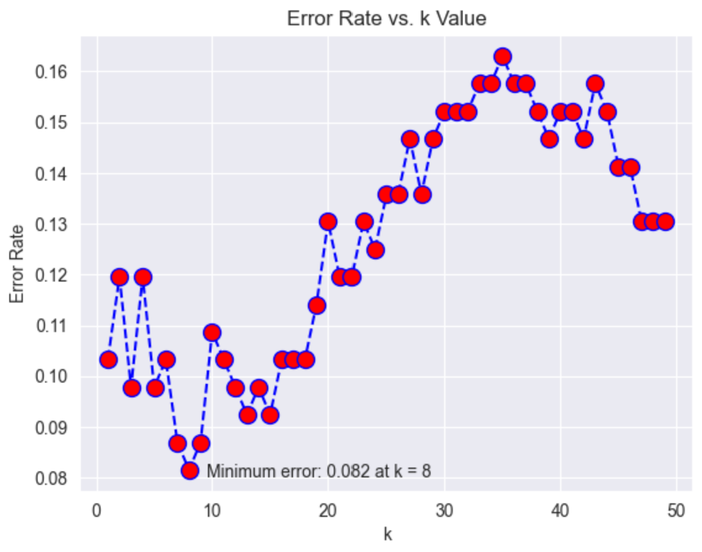
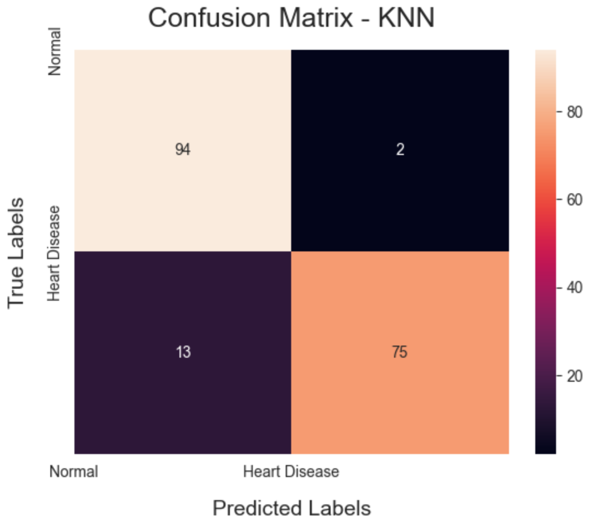

# [Project 1: Airbnb Analysis](https://github.com/Max-Boonjindasup/airbnb_analysis/tree/main)
* Analyzed over 50,000 NYC Airbnb entries using NumPy and Pandas and discovered that Manhattan has ~80% of the market share, comparison models visualized with Matplotlib and Seaborn.
* Employed 5 different regression models and achieved a 99% accuracy in predicting geographic location based on pricing information, enabling actionable insights into targeting new clients and optimizing market strategies.
* Created an effective model that provides actionable insights into targeting new clients and optimizing market strategies.

# [Project 2: Heart Disease Predictor](https://github.com/Max-Boonjindasup/heart_disease_predictor/blob/main/README.md)
* Performed exploratory data analysis on ~900 patient samples through NumPy, Pandas, and Matplotlib to identify patterns, handle missing and categorical data, and transform datasets.
* Trained 5 ML models (kNN, NN, XGBoost, DT, and SVM) using cross-validation, GridSearchCV, scikit-learn, and tensorflow to classify the presence and absence of heart disease and evaluated each model’s  and accuracy.

